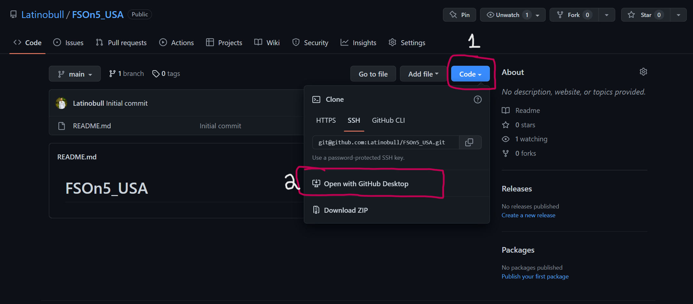
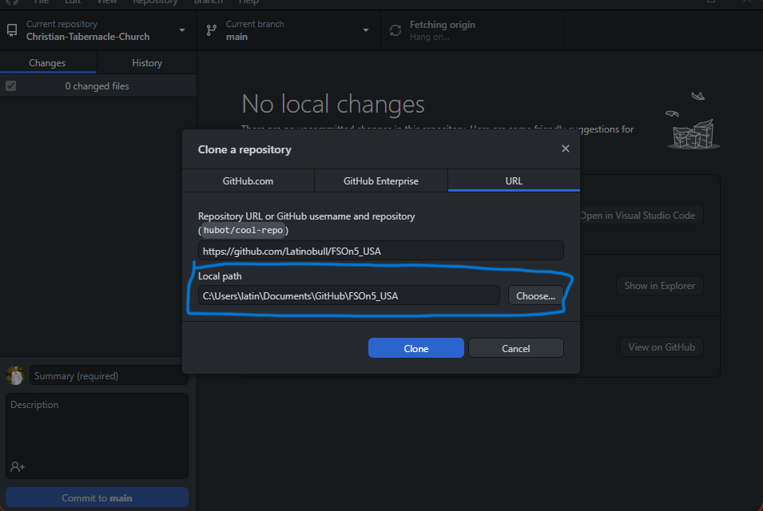

# Cloning this Repo onto your local machine

## Step 1

Go on to github.com and go to the link of the application. The link is https://github.com/Latinobull/FSOn5_USA

## Step 2

Clone this repo using the code button on github (#1). Then clicking open with Github Desktop (#2).



## Step 3
GitHub Desktop will open and will verify which location you want to store it in or the local path to store this repo in. If you want to move it to a specific folder on your computer, then click the Choose button. (The default location will be Documents/Github).
Then you click clone.


You now will have access to all of the class resources and activities will be using throughout the course. For every lesson, you will now be able to run the command

```
git pull
```
in your respective terminal to retrieve the latest content