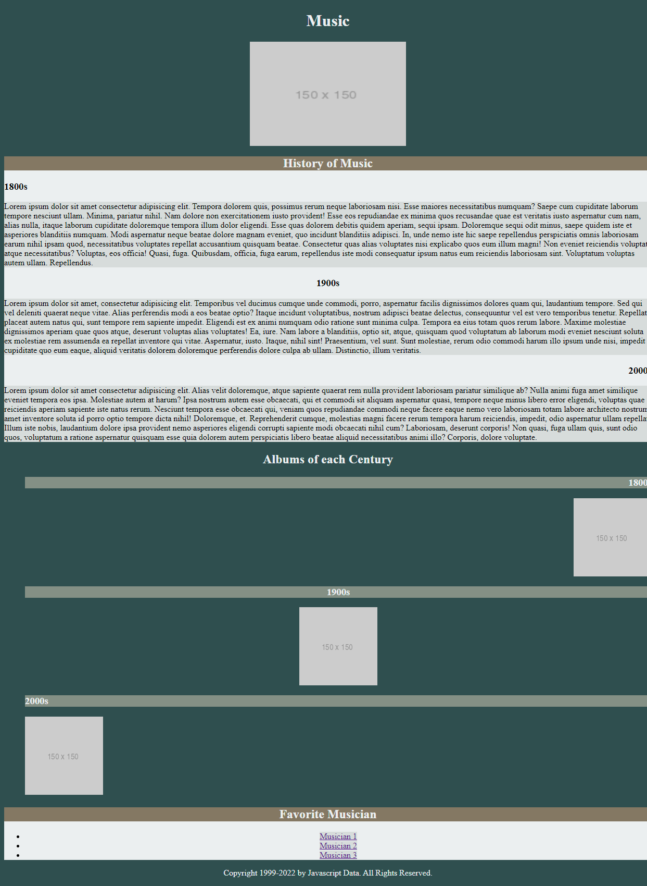

# Replication

## Instructions

Replicate the photos below using your knowledge of CSS. This is to train you on working on already written code and being able to make impactful changes to the code. Exactly how it would be if you are working on a team of developers.

Below you are given the wireframe on how the application should look

## Additional Notes

- You are given starter code, before you write any code, understand the code you are working with. Understand the structure of the HTML and any styling that is provided to you
- There are multiple ways to write this. Write this code the way it makes sense to you.
- You are not expected to finish this activity in the time provided
- Use Google if needed... There is no cheating in coding!
