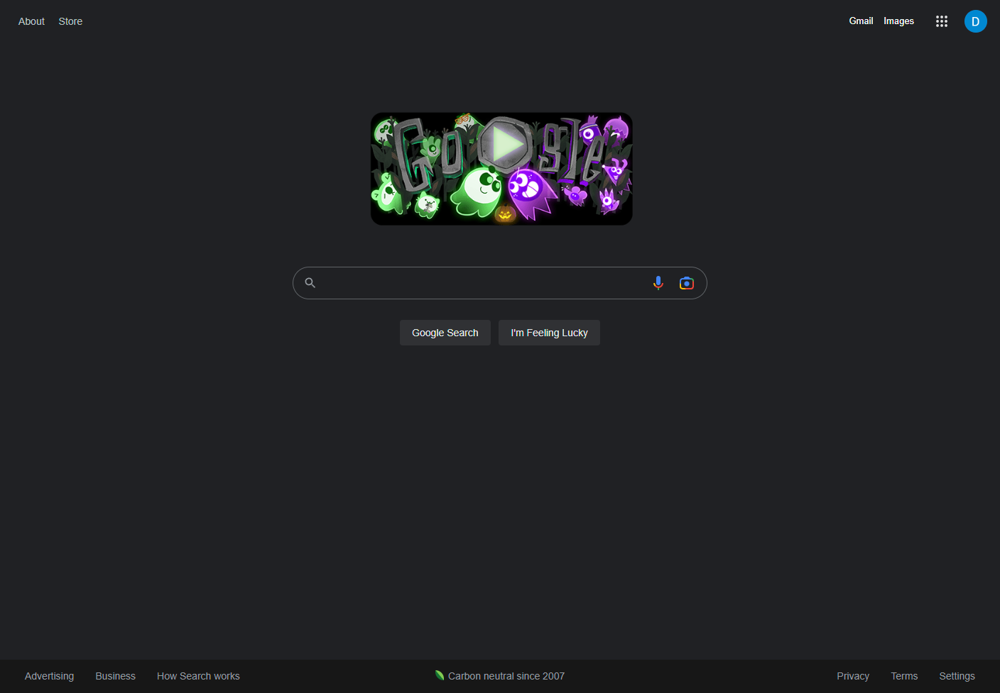
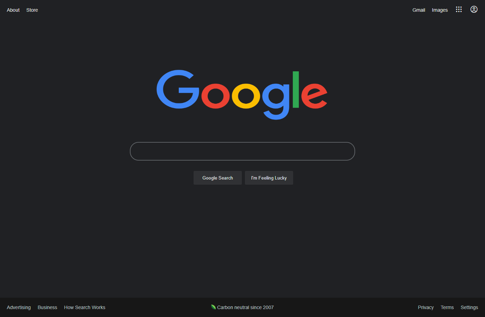

# Google!!!!

## Instructions

Recreate the Google Homepage. Google has some of the simplest and cleanest home pages on the web. Let's recreate the Google.com page using everything we learning such as flexbox, CSS variables, and semantic HTML!

Use all tools necessary to complete this challenge including Google itself
You can push this to GitHub if you want but you are not required to

As well, The starter code is based on Google.com dark mode. If you want to switch to light mode, you can do so.

<hr>

## Mock Up

Actual Google Site


Accepted Submission


## Resources

If you want to use the application Icon you'll need this line

```html
<span class="material-symbols-outlined"> apps </span>
```

To use the profile icon, you will need this line

```html
<span class="material-symbols-outlined"> account_circle </span>
```
They are already linked on the HTML page, you just need to call them when needed. 


